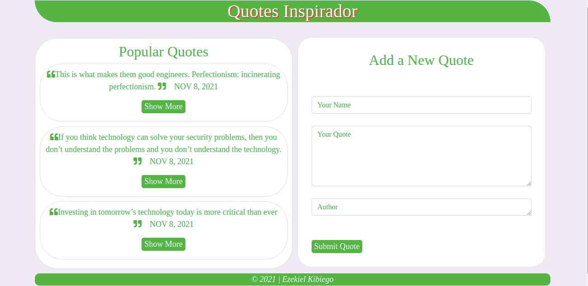

# Quotes App
#### A Quotes Application, 8th October 2021
#### By **Ezekiel Kibiego**

## ScreenShot

## Description
This is a Quotes application that displays different quotes then allows one to add a new quote. on each quote the user is able to upvote or downvote on that specific vote. The user is finally able to delete any quote if he/she so wishes.

# Installation / Setup instruction

<ul>
<li>Open Terminal {Ctrl+Alt+T}</li>
<li>git clone https://github.com/ezekielkibiego/Quotes-App.git</li>
<li>cd Quotes-App </li>
<li> Run `ng serve` for a dev server. Navigate to `http://localhost:4200/`. The app will automatically reload if you change any of the source files.</li>
</ul>

# Code scaffolding
Run ng generate component component-name to generate a new component. You can also use ng generate directive|pipe|service|class|guard|interface|enum|module.

# Running unit tests
Run ng test to execute the unit tests via Karma.

### Live Link
https://ezekielkibiego.github.io/Quotes-App/

## Known Bugs

No known Bugs yet

## Technologies Used

This project was generated with Angular CLI version 12.2.8.

<ul>
<li>ANGULAR</li>
<li>TYPESCRIPT</li>
<li>JAVASCRIPT</li>
<li>HTML</li>
<li>CSS</li>
<li>BOOTSTRAP</li>
</ul>

## BDD
Click "Show More" Button:

<ul>
<li>See more details like, author, posted by, vote uo/down and Delete option</li>
<li>On completing reading a quote and it's details, vote up/down </li>
<li>Delete Quote</li>
<li>Add a new quote on the form section</li>
<li>submit form by clicking add Quote button</li>
<li>Check your new quote on the quotes list section</li>
</ul>

## Support and contact details
To get more help on the Angular CLI use ng help or go check out the Angular CLI README. For any queries feel free to contact me via my email addresses ezekiel.nyambane@student.moringaschool.com or kibiezekiel@gmail.com
### License

 #### MIT LICENCE

Copyright (c) 2021 **Ezekiel Kibiego**

Permission is hereby granted, free of charge, to any person obtaining a copy
of this software and associated documentation files (the "Software"), to deal
in the Software without restriction, including without limitation the rights
to use, copy, modify, merge, publish, distribute, sublicense, and/or sell
copies of the Software, and to permit persons to whom the Software is
furnished to do so, subject to the following conditions:

The above copyright notice and this permission notice shall be included in all
copies or substantial portions of the Software.

THE SOFTWARE IS PROVIDED "AS IS", WITHOUT WARRANTY OF ANY KIND, EXPRESS OR
IMPLIED, INCLUDING BUT NOT LIMITED TO THE WARRANTIES OF MERCHANTABILITY,
FITNESS FOR A PARTICULAR PURPOSE AND NONINFRINGEMENT. IN NO EVENT SHALL THE
AUTHORS OR COPYRIGHT HOLDERS BE LIABLE FOR ANY CLAIM, DAMAGES OR OTHER
LIABILITY, WHETHER IN AN ACTION OF CONTRACT, TORT OR OTHERWISE, ARISING FROM,
OUT OF OR IN CONNECTION WITH THE SOFTWARE OR THE USE OR OTHER DEALINGS IN THE
SOFTWARE.
  